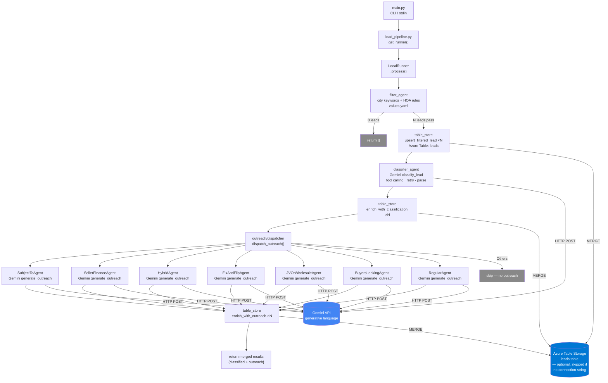
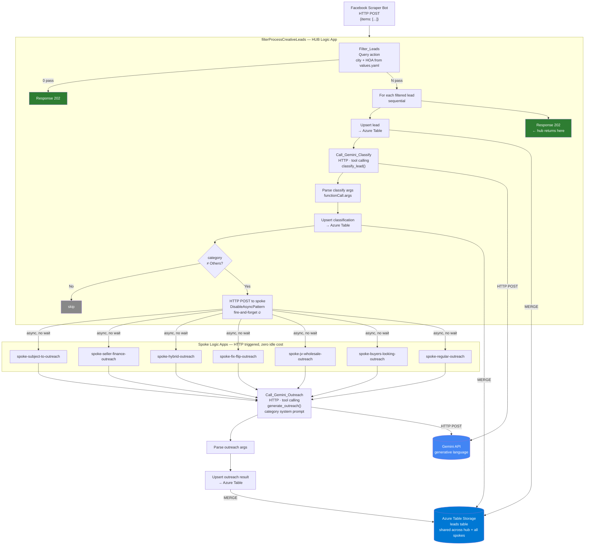
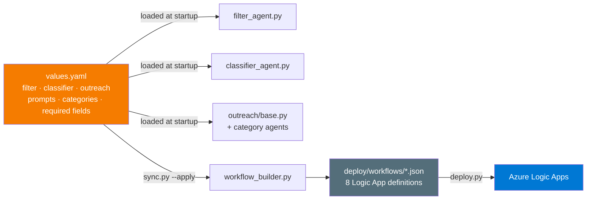

# Lead Scraper — Architecture

Two parallel implementations of the same pipeline. Same logic, same Gemini calls, same Azure Table as shared memory. Local mode is synchronous (dev/test); Azure mode is async fire-and-forget (production).

---

## Python Local Pipeline (`RUN_MODE=local`)

**Key points:**
- Runs entirely in-process — no Azure trigger needed
- Outreach agents run sequentially (one Gemini call per lead per category)
- Table writes are optional (skip gracefully if `AZURE_STORAGE_CONNECTION_STRING` not set)
- All prompts, categories, required fields driven by `values.yaml`

---

## Azure Logic App Pipeline (`RUN_MODE=azure` / Production)

**Key points:**
- Hub returns 202 immediately — never waits for spoke results
- Spokes are HTTP-triggered: **zero polling, zero idle cost**, only billed per execution
- Spoke trigger URLs are resolved at deploy time by Bicep (`listCallbackUrl()`), stored as hub parameter
- All Logic App workflow JSON generated by `sync.py --apply` from `values.yaml`
- One `azuretables` API connection shared by hub + all spokes

---

## Shared Config Layer

`values.yaml` is the **single source of truth** — changing a prompt, category, or required field updates both the Python agents (immediately on next run) and the Azure Logic Apps (after `sync.py --apply` + `deploy.py`).

---

## Azure Resources Deployed

| Resource | Type | Purpose |
|---|---|---|
| `releadscraper` | Storage Account | Table storage for pipeline shared memory |
| `leads` | Azure Table | Per-lead data: filtered → classified → outreach |
| `appversions` | Azure Table | Sync/deploy version tracking |
| `azuretables-lead-pipeline` | API Connection | Connector for all Logic Apps → Table |
| `filterProcessCreativeLeads` | Logic App | Hub: webhook ingest, filter, classify, route |
| `spoke-subject-to-outreach` | Logic App | Subject-To outreach agent |
| `spoke-seller-finance-outreach` | Logic App | Seller Finance outreach agent |
| `spoke-hybrid-outreach` | Logic App | Hybrid outreach agent |
| `spoke-fix-flip-outreach` | Logic App | Fix & Flip outreach agent |
| `spoke-jv-wholesale-outreach` | Logic App | JV or Wholesale outreach agent |
| `spoke-buyers-looking-outreach` | Logic App | Buyers Looking outreach agent |
| `spoke-regular-outreach` | Logic App | Regular outreach agent |
